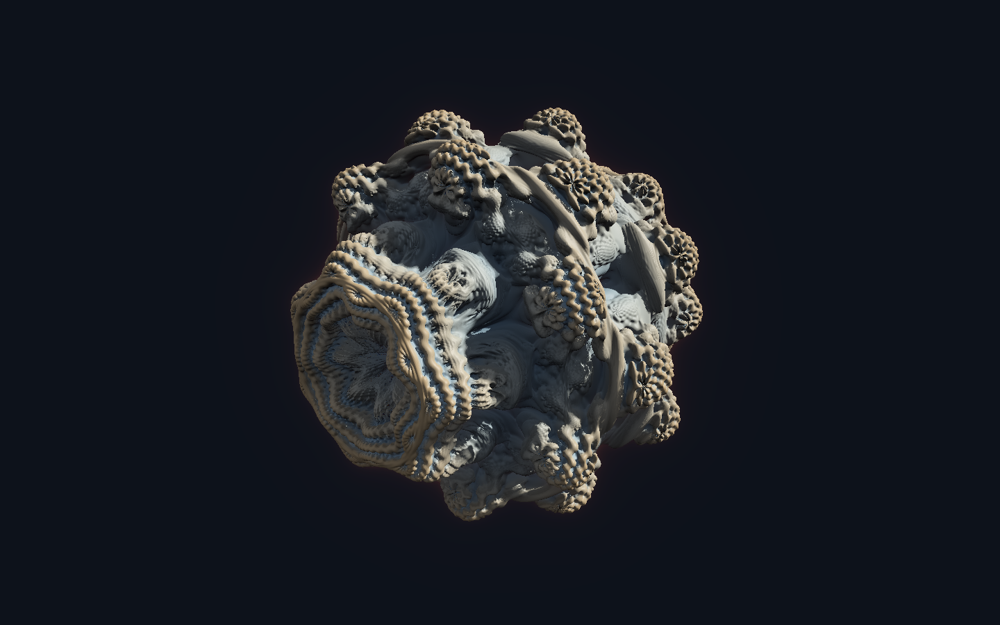

# 3DM

A modern Mandelbulb explorer for the browser — a spiritual successor to
Mandelbulb 3D, rebuilt on WebGPU.

The fractal is rendered entirely on the GPU: a single fragment shader
sphere-traces a distance-estimated Mandelbulb, shades the hit with an
orbit-trap palette, ray-marched soft shadows and ambient occlusion, and
composites under an egui control panel. The CPU only owns the camera and the
parameter set.



## Status

Milestone 2 — the hybrid formula stack.

A fractal is an ordered stack of formulas, each applied inside a single
escape-time iteration over a chosen range of iterations. The distance estimator
is **generated** from the stack ([`src/render/codegen.rs`](src/render/codegen.rs))
and the compiled pipeline is cached per stack structure, so parameter and
iteration-range edits never trigger a shader rebuild — only adding, removing or
reordering formulas does.

Formulas: Mandelbulb, Juliabulb, Mandelbox, Sierpinski (kaleidoscopic IFS) and
a Rotate transform. Up to six slots.

Working:

- Hybrid formula stacks with per-formula parameters and iteration ranges
- Automatic choice of logarithmic vs linear distance estimator, with an override
- Sphere tracing with a pixel-sized, distance-adaptive hit threshold, so detail
  holds at any zoom instead of dissolving as you approach the surface
- Orbit / pan / dolly camera, with a reduced-quality preview while dragging
- Cosine-palette colouring driven by the orbit trap, soft shadows, AO, specular,
  glow and distance fog — all live
- Headless PNG rendering (`examples/still.rs`)
- Debug views that render one shading term on its own

### A note on distance-estimate tightness

Escape-time formulas (Mandelbulb, Juliabulb) produce a distance estimate close
to the true distance. Folding formulas (Mandelbox, Sierpinski) produce a valid
*lower bound* that can underestimate by two orders of magnitude.

Anything that compares against a distance therefore has to be told how loose the
estimate is, or it silently misbehaves on half the formulas. `de_tightness()` in
[`fractal.wgsl`](src/render/fractal.wgsl) samples this at the shading point and
scales the shadow march by it. Without that correction the folding fractals
report their own surface as occluding and render black — which they did.

Not built yet: presets and project files, animation, more formulas.

## Requirements

A **WebGPU** browser — recent Chrome or Edge, or Safari 26+. There is no WebGL
fallback; the renderer is too shader-heavy for one to be worth maintaining.

## Running

Development server with hot reload:

```bash
trunk serve
```

Then open <http://127.0.0.1:8080>.

Production build into `dist/`:

```bash
./build-release.sh
```

`dist/` is a static bundle — serve it from anywhere. Enable gzip or brotli on
the server; the wasm is ~6.9 MB raw but ~2.7 MB gzipped.

### Native build

The app also builds natively, which is the fastest way to iterate on the
renderer without a browser in the loop:

```bash
cargo run
```

### Headless stills

Renders one frame straight to a PNG with no window and no browser — useful over
SSH, in CI, and for checking shader changes:

```bash
cargo run --example still -- out.png 1920 1200
```

It takes a demo stack as a fourth argument — `mandelbulb`, `juliabulb`,
`mandelbox`, `sierpinski`, `hybrid` or `rotbox`:

```bash
cargo run --example still -- box.png 1280 800 mandelbox
```

`DM3_ISOLATE` disables one shading term at a time, which is how the issue above
was narrowed down. Values: `flat`, `noao`, `nofog`, `noglow`, `noshadow`,
`amb0`, `amb1`, `safede`, `bigbail`, `grey`, `softk`.

```bash
DM3_ISOLATE=amb0 cargo run --example still -- direct.png 640 480 mandelbox
```

## Deployment

Production runs on [Fly.io](https://fly.io) as app `3dm` in `yyz`, serving the
static bundle from a Caddy container.

```bash
fly deploy
```

The [`Dockerfile`](Dockerfile) builds the wasm from source, runs `wasm-opt -Oz`
over it, and precompresses everything with gzip and brotli so Caddy can serve
`.br`/`.gz` directly instead of compressing per request. Content-hashed assets
are cached forever; `index.html` is always revalidated so a deploy takes effect
immediately.

Machines auto-stop when idle (`min_machines_running = 0`) — a static bundle has
no state to lose, so there is nothing to pay for between visits. `force_https`
is on because **WebGPU only works in a secure context**; the app is dead over
plain HTTP.

Useful checks:

```bash
fly logs
fly status
fly open
```

## Layout

| Path | Contents |
| --- | --- |
| `src/render/fractal.wgsl` | The distance estimator, sphere tracer and shading — the whole image |
| `src/render/mod.rs` | wgpu pipeline, uniform layout, egui paint callback |
| `src/params.rs` | Scene parameters (fractal, raymarch, shading) |
| `src/camera.rs` | Orbit camera |
| `src/app.rs` | egui UI and camera input |
| `examples/still.rs` | Headless PNG renderer |

## Notes on colour

Every colour in `params.rs` is **linear**, not sRGB. A background of `0.005`
is near-black on screen, not a dark grey. The shader applies the sRGB transfer
curve itself only when the surface format is linear (`encode_srgb`), since a
`*Srgb` surface format has the hardware do it.

## Toolchain quirks

- Trunk's built-in `wasm-opt` step fails against Homebrew's binaryen, so
  `index.html` sets `data-wasm-opt="0"` and `build-release.sh` runs `wasm-opt`
  itself. `--no-sri` goes with it, because rewriting the wasm after Trunk has
  hashed it would break sub-resource integrity.
- Do not set `strip = true` in the release profile: the resulting wasm fails
  binaryen's validator.
